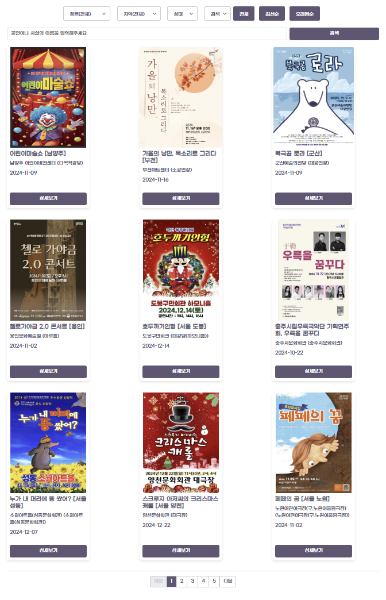
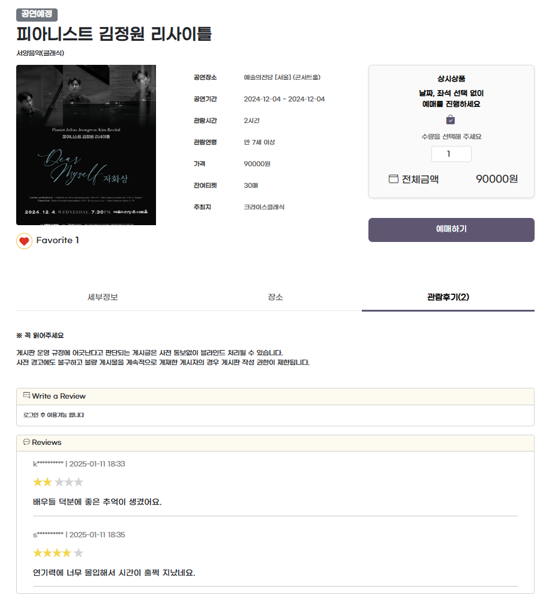
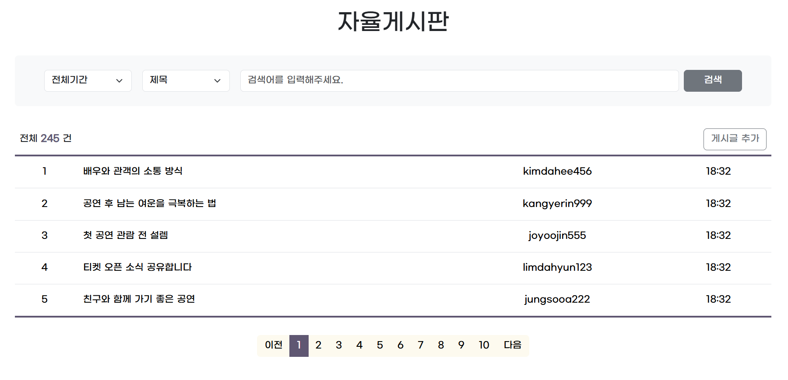
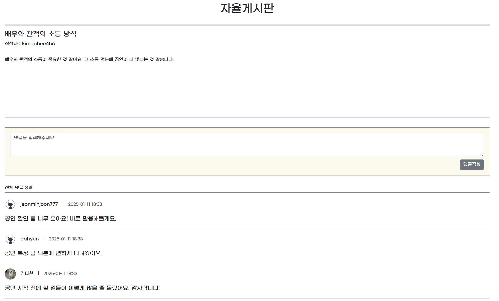

### 목차
> 1. [프로젝트 소개](#프로젝트-소개)   
> 2. [IA 정보구조도](#IA-정보구조도)   
> 3. [ERD 엔티티 관계도](#ERD-엔티티-관계도)   
> 4. [기술 스택](#기술-스택)   
> 5. [주요 기능](#주요-기능)   
> 6. [주요 화면](#주요-화면)
> 7. [API 명세](#API-명세)
> 8. [AWS 배포](#AWS-배포)
> 9. [향후 개선 사항](#향후-개선-사항)

# 프로젝트 소개
> </img> 
> ### 문화를 보다, SHOW 문화 서비스 제공 플랫폼
>
> 공공 API를 연동하여 다양한 공연 정보를 수집, 가공하여 사용자 맞춤형 조회 서비스를 제공합니다.   
> 사용자는 원하는 공연 정보를 검색하고, 관심있는 공연을 즐겨찾기로 등록하며, 티켓 예매 결제 및 후기를 작성할 수 있습니다.   
> 게시판 기능을 통해 사용자 간 의견을 공유하고, 공연에 대한 다양한 관점을 나눌 수 있는 플랫폼을 구축하고 이로써 사용자 친화적이고 기능적으로 완성도 높은 공연 정보 서비스를 제공합니다.
>
> SpringBoot 프레임워크를 사용하여 MVC 패턴의 기본적인 CRUD를 구현하고
> AJAX를 통해 REST API를 설계하여 사용자 중심의 HTTP 비동기 처리를 구현하였습니다.
>
> **REFERENCE** [인터파크티켓](https://tickets.interpark.com)

> ### 개발 기간
> 2024.9.30 ~ 2024.10.25 (26일)

> ### 개발 인원(2명)
> **김준선(FULLSTACK)**   
> 개발환경 구축, GIT 관리   
> 메인, 로그인, 회원가입, 게시판, 사용자 마이페이지(회원정보관리, 게시글, 예매결제), 관리자 마이페이지 구현
>
> **김다현(FULLSTACK)**   
> 기획, 설계, API 연동   
> 메인, 공연목록, 공연상세, 사용자 마이페이지(즐겨찾기, 공연후기, 달력) 구현   
> UI 디자인(전체)
>

# IA 정보구조도
</img> 

# ERD 엔티티 관계도
</img>  

# 기술 스택
</img> 

# 주요 기능
### 요약
|공통|사용자|관리자|
|------|---|---|
|-회원가입, 로그인 -메인화면 -공연목록 및 공연상세 조회 -게시글 조회|-즐겨찾기 추가 -공연후기 작성 -예매 결제 -게시글, 댓글 작성 -마이페이지|-API 관리 -공연 관리 -회원 관리 -게시글 관리|

## [공통 기능]
### 회원가입, 로그인
* 아이디, 비밀번호 유효성 검증과 비밀번호 암호화를 설정했다.
* 카카오 로그인 시 자동 회원가입 가능하다.
* 일반로그인과 카카오 로그인 회원의 권한이 분리되어 있다.
### 메인화면
* 금주의 공연, 장르별 공연의 목록 조회가 가능하다.
* 기본으로 8개가 보여지며 더보기를 누르면 8개씩 추가로 조회할 수 있다.
### 공연 목록
* 장르, 지역, 공연상태에 따른 조회가 가능하다.
* 공연이름이나 공연시설이름으로 검색 조회가 가능하다.
* 날짜순으로 정렬이 가능하며 한 페이지에 9개의 공연 목록이 나타난다.
### 공연 상세
* 공연의 세부정보와 즐겨찾기 갯수, 남은 티켓 갯수를 조회할 수 있다.
* 카카오 지도로 공연장 위치조회와 길찾기 서비스를 사용할 수 있다.
* 공연 후기와 별점 조회가 가능하다.
* 공연 후기는 작성자명의 첫 글자와 작성 시간이 보여진다.
### 게시판
* 게시글과 댓글을 날짜순, 제목이나 작성자로 검색 조회가 가능하다.
* 댓글은 작성자의 프로필 사진과 작성자명, 작성 시간이 보여진다.

## [사용자 기능]
### 츨겨찾기 관리
* 공연상세에서 즐겨찾기 추가, 취소가 가능하다.
* 즐겨찾기된 공연은 마이페이지에 추가되며 추가된 공연들의 일정을 달력으로 확인할 수 있다.
### 공연 후기 관리
* 공연상세에서 공연에 대한 별점과 후기를 남길 수 있다.
* 작성자와 로그인된 회원이 같다면 후기 수정, 삭제가 가능하다.
* 마이페이지에서도 조회, 수정, 삭제가 가능하다.
### 예매 결제 관리
* 공연상세에서 잔여티켓 내에서 최대 4장까지 예매 가능하다.
* 예매가 완료된 공연은 마이페이지에 추가되며 예매 취소가 가능하다.
### 게시글, 댓글 관리
* 게시판에 게시글과 게시글에 대한 댓글을 작성할 수 있다.
* 작성자와 로그인된 회원이 같다면 게시글 수정, 삭제가 가능하다.
* 마이페이지에서도 조회, 수정, 삭제가 가능하다.

## [관리자 기능]
### API 관리
* 1주 단위로 API 업데이트와 삭제를 할 수 있다.
### 공연 관리
* 모든 공연의 조회, 삭제가 가능하다.
### 회원 관리
* 모든 회원의 정보를 아이디나 이름으로 검색 조회가 가능하며 수정, 삭제도 가능하다.
### 게시글 관리
* 모든 게시글을 기간이나 제목, 작성자로 검색 조회가 가능하며 수정, 삭제도 가능하다.

# 주요 화면
|메인|회원가입|
|------|---|
|</img>|</img>|
|공연목록|공연상세|
|</img>|</img>|
|게시판|게시글|
|</img>|</img>|
|마이페이지|관리자페이지|
|</img>|</img>|

# API 명세
|Domain|URL|Method|Description|Role|
|------|---|---|---|---|
|Member|/admin/managementAPI|GET|관리자페이지 API 조회|Admin|
||/admin/managementAPI/update|GET|관리자페이지 API 수정 |Admin|
||/admin/managementAPI/delete|POST|관리자페이지 API 삭제|Admin|
||/admin/managementAPI/detail /managementAPI/detail/{page}|GET|관리자페이지 공연 조회|Admin|
||/admin/managementAPI/deleteShow/{id}|DELETE|관리자페이지 공연 삭제|Admin|
||/admin/managementMember/list /admin/managementMember/list/{page}|GET|관리자페이지 회원 조회|Admin|
||/admin/managementMember/delete|GET|관리자페이지 회원 삭제|Admin|
||/admin/managementMember/editMember|POST|관리자페이지 회원정보 수정|Admin|
||/admin/managementBoard/list /admin/managementBoard/list/{page}|GET|관리자페이지 게시글 조회|Admin|
||/admin/managementBoard/delete|GET|관리자페이지 게시글 삭제|Admin|
||/members/agree|GET|약관동의||
||/members/new|GET|회원가입||
||/members/login|GET|로그인||
||/members/delete|GET|로그아웃|User|
||/members/info|GET|마이페이지 조회|User|
||/members/updateInfo|GET|마이페이지 프로필 이미지 수정|User|
||/members/update|POST|마이페이지 회원 정보 수정|User|
||/members/myBoards /members/myBoards/{page}|GET|마이페이지 내가 쓴글 조회|User|
||/favorite/event|GET|마이페이지 즐겨찾기 달력 요청|User|
||/order/event|GET|마이페이지 예매내역 달력 요청|User|
|Order|/order|POST|공연상세 공연예매|User|
||/orders /orders/{page}|GET|마이페이지 예매 내역 조회|User|
||/order/{orderNum}/cancel|POST|마이페이지 예매 취소|User|
|Favorite|/favorites /favorites/{page}|GET|마이페이지 즐겨찾기 조회|User|
||/favorite|POST|공연상세 즐겨찾기 추가|User|
||/favorite/{mt20id}/cancel|POST|공연상세 즐겨찾기 취소|User|
|Review|/show/{mt20id}/review|POST|공연상세 공연후기 추가|User|
||/show/{mt20id}/review/{num}|POST DELETE|공연상세 공연후기 수정, 삭제|User|
||//reviews /reviews/{page}|GET|마이페이지 공연후기 조회|User|
|Show|/|GET|메인페이지||
||/loadMoreShows|GET|메인페이지 더보기 조회||
||/genreFilter|GET|메인페이지 장르별 조회||
||/shows /shows/{page}|GET|공면목록 조회||
||/show/{mt20id}|GET|공면상세 조회||
|Board|/board /board/{page}|GET|게시판 게시글 조회||
||/board/write|GET|게시판 게시글 작성 폼|User|
||/board/write|POST|게시판 게시글 작성|User|
||/board/showModify/{boardId}|POST|게시판 게시글 수정 폼|User|
||/board/modify/{boardId}|POST|게시판 게시글 수정|User|
||/board/delete/{boardId}|POST|게시판 게시글 삭제|User|
||/board/boardDtl/{boardId}|GET|게시판 게시글 상세조회||
|Reply|/addReply/{id}/reply|POST|게시판 댓글 추가|User|
||/board/{id}/reply/{replyId}/update|POST|게시판 댓글 수정|User|
||/board/{id}/reply/{replyId}/remove|POST|게시판 댓글 삭제|User|

# AWS 배포포

# 향후 개선 사항
> * 회원가입 시 아이디, 이메일 중복 체크 및 휴대전화 인증 절차 구현   
> * 회원가입 시 주소찾기 API 를 사용하여 우편번호와 상세 주소 구현   
> * 휴대전화 인증으로 아이디, 비밀번호 찾기 서비스 구현   
> * AJAX 비동기 통신으로 즐겨찾기 기능 수정   
> * 공연 예매 시 시간, 날짜, 좌석 선택과 환불 정책에 따른 환불서비스 구현   
> * 사용자들이 실시간 소통을 할 수 있는 커뮤니티 기능 구현   
